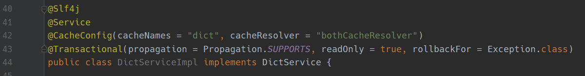
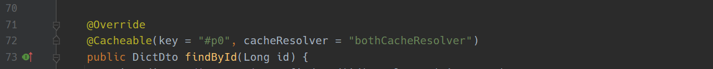

# BothCache
一个springboot项目里的二级缓存实现[DEMO](https://github.com/supalle/BothCacheDemo)

## 特点：
1. 简单，只需要往项目里粘贴这类，目前的版本连jar包都不需要引入。
2. 基于SpringCache，所以完全兼容现在大量使用的@CacheConfig和@Cacheable等注解

## 使用方法：
### 前置条件：首先项目里得有SpringData Redis和caffeine，最好是已经用着了，没有就加一下依赖。
### 步骤1：往项目里添加[BothCacheConfig](./BothCacheConfig.java)类，包名请换成你自己项目里的包名：
### 步骤2：application.yml 里添加配置
```yaml
spring.cache.caffeine.spec: expireAfterWrite=5s # 缓存写后多长时间过期
```
### 步骤3：需要二级缓存的地方使用二级缓存，在注解里加上 `cacheResolver = "bothCacheResolver"` 即可：
1. @CacheConfig 里添加 `cacheResolver = "bothCacheResolver"`
```java
@CacheConfig(cacheNames = "dict", cacheResolver = "bothCacheResolver")
```
如图：


2. @Cacheable里添加`cacheResolver = "bothCacheResolver"`
```java
@Cacheable(key = "#p0", cacheResolver = "bothCacheResolver")
```
如图：


其它注解一致。

## 最后：请原谅我没写注释

### That it.
